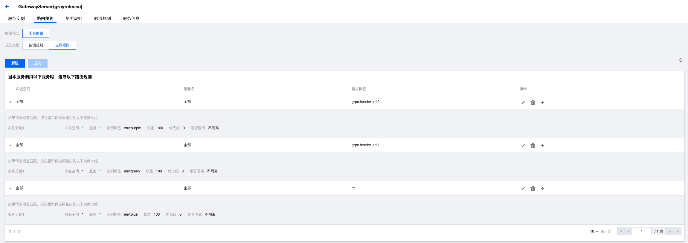
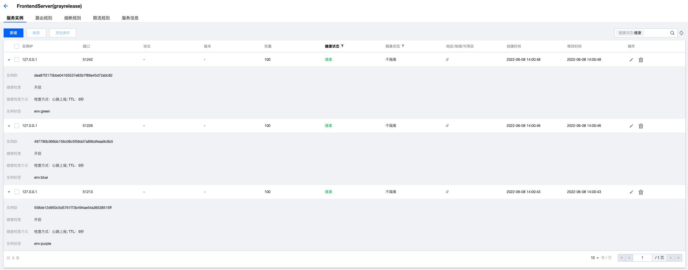

# gRPC-java-polaris Gray Release Example

[English](./README.md) | 简体中文

<!-- TOC -->
* [gRPC-java-polaris Gray Release Example](#grpc-java-polaris-gray-release-example)
  * [项目说明](#)
  * [示例架构](#)
  * [如何接入](#)
    * [启动网关服务](#)
    * [启动Front服务](#front)
      * [启动基线环境（蓝色）](#)
      * [启动灰度环境1（绿色）](#1)
      * [启动灰度环境2（紫色）](#2)
      * [启动后效果](#)
    * [启动middle服务](#middle)
      * [启动基线环境（蓝色）](#)
      * [启动灰度环境2（紫色）](#2)
    * [启动back服务](#back)
      * [启动基线环境（蓝色）](#)
      * [启动灰度环境1（绿色）](#1)
    * [测试](#)
      * [基线环境路由](#)
      * [灰度环境1（绿色）路由](#1)
      * [灰度环境2（紫色）路由](#2)
<!-- TOC -->

## 项目说明

本项目演示如何使用 gRPC-java-polaris 完成 gRPC-java 应用的全链路灰度。

## 示例架构


本示例请求都通过最上层网关进行分发，分发的目的地主要涉及3个环境：
- 灰度环境1（只针对uid=1的请求放开），环境标识为env=green（绿色环境）
- 灰度环境2（只针对uid=2的请求放开），环境标识为env=purple（紫色环境）
- 基线环境（稳定的业务版本，针对其他请求放开），环境标识为env=blue（蓝色环境）

## 如何接入

### 启动网关服务
1. 修改 polaris.yaml 文件
    - 北极星服务端地址：grpc://127.0.0.1:8091

2. 启动router-grayrelease-gateway应用

    - IDE直接启动：找到主类 `GatewayServer`，执行 main 方法启动应用。
    - 打包编译后启动：首先执行 `mvn clean package` 将工程编译打包，然后执行 `java -jar router-grayrelease-gateway-${verion}.jar`启动应用。

3. 添加路由规则
   

### 启动Front服务

#### 启动基线环境（蓝色）

1. 修改 polaris.yaml 文件
    - 北极星服务端地址：grpc://127.0.0.1:8091

2. 启动router-grayrelease-frontend应用

    - IDE直接启动：找到主类 `FrontendServer`，执行 main 方法启动应用。
    - 打包编译后启动：首先执行 `mvn clean package` 将工程编译打包，然后执行 `java -jar router-grayrelease-frontend-${verion}.jar blue`启动应用。

#### 启动灰度环境1（绿色）

1. 修改 polaris.yaml 文件
    - 北极星服务端地址：grpc://127.0.0.1:8091

2. 启动router-grayrelease-frontend应用，执行 `java -jar router-grayrelease-frontend-${verion}.jar green`启动应用

#### 启动灰度环境2（紫色）

1. 修改 polaris.yaml 文件
    - 北极星服务端地址：grpc://127.0.0.1:8091

2. 启动router-grayrelease-frontend应用，执行 `java -jar router-grayrelease-frontend-${verion}.jar purple`启动应用

#### 启动后效果

在北极星控制台，可以看到gray-release-front服务下有3个节点，每个节点有不同的环境标识。



### 启动middle服务

#### 启动基线环境（蓝色）

1. 修改 polaris.yaml 文件
    - 北极星服务端地址：grpc://127.0.0.1:8091

2. 启动router-grayrelease-middle应用

    - IDE直接启动：找到主类 `MiddleServer`，执行 main 方法启动应用。
    - 打包编译后启动：首先执行 `mvn clean package` 将工程编译打包，然后执行 `java -jar router-grayrelease-middle-${verion}.jar blue`启动应用。


#### 启动灰度环境2（紫色）

1. 修改 polaris.yaml 文件
    - 北极星服务端地址：grpc://127.0.0.1:8091

2. 启动router-grayrelease-middle应用，然后执行 `java -jar router-grayrelease-middle-${verion}.jar purple`启动应用。

### 启动back服务

#### 启动基线环境（蓝色）

1. 修改 polaris.yaml 文件
    - 北极星服务端地址：grpc://127.0.0.1:8091

2. 启动router-grayrelease-backend应用

    - IDE直接启动：找到主类 `BackendServer`，执行 main 方法启动应用。
    - 打包编译后启动：首先执行 `mvn clean package` 将工程编译打包，然后执行 `java -jar router-grayrelease-backend-${verion}.jar blue`启动应用。

#### 启动灰度环境1（绿色）

1. 修改 polaris.yaml 文件
    - 北极星服务端地址：grpc://127.0.0.1:8091

2. 启动router-grayrelease-backend应用，然后执行 `java -jar router-grayrelease-backend-${verion}.jar green`启动应用。

### 测试

#### 基线环境路由

````
curl -H 'uid:0' 127.0.0.1:40041/echo
````
获取结果
````
GatewayServer -> FrontendServer[{env=blue}] -> MiddleServer[{env=blue}] -> BackendServer[{env=blue}]
````

#### 灰度环境1（绿色）路由

````
curl -H'uid:1' 127.0.0.1:40041/echo
````
获取结果
````
GatewayServer -> FrontendServer[{env=green}] -> MiddleServer[{env=blue}] -> BackendServer[{env=green}]
````

#### 灰度环境2（紫色）路由

````
curl -H'uid:2' 127.0.0.1:40041/echo
````
获取结果
````
GatewayServer -> FrontendServer[{env=purple}] -> MiddleServer[{env=purple}] -> BackendServer[{env=blue}]
````
